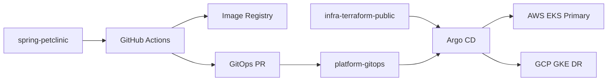

# platform-gitops

[한국어 README](./README.md)

GitOps desired-state repo for deploying Spring Petclinic to AWS EKS as the primary cluster and GCP GKE as the DR candidate.

This is not the Argo CD installation repo. Argo CD bootstrap and platform install live in the separate `infra-terraform-public` repo. This repo stores the manifests that Argo CD watches after bootstrap is complete.

## Overview

- `spring-petclinic`: builds and publishes images, then opens a GitOps PR to this repo
- `infra-terraform-public`: provisions infra and installs Argo CD, External Secrets, and traffic dependencies
- `platform-gitops`: stores the cloud-specific desired state for the running workload



## Structure

```text
aws/
gcp/
```

- `aws/`: manifests for the primary deployment
- `gcp/`: manifests for the DR candidate deployment
- shared resources include the app namespace, service account, `ExternalSecret`, Deployment, and traffic entry
- AWS also contains HPA and Karpenter NodePool direction

## Operating Model

- This repo does not model `dev` / `stage` / `prod`.
- AWS primary and GCP DR are operational roles, not promotion stages.
- `spring-petclinic` CI publishes images first, then opens a PR here with the new image tags.
- Deployment changes are applied through Git merge, then Argo CD pulls and syncs them.
- Rollback is handled by reverting the Git commit and letting Argo CD resync.

## Reproducible Flow

1. Bootstrap clusters and platform components from `infra-terraform-public`.
2. Set the cloud-specific values in this repo through Git.
3. Build and publish images from `spring-petclinic`.
4. Review and merge the GitOps PR opened against this repo.
5. Let Argo CD apply the new desired state.

Key configuration points:

- image registry URLs in `aws/20-petclinic-Deployments-mysql.yaml` and `gcp/20-petclinic-Deployments-mysql.yaml`
- hostnames / traffic entry in `aws/31-petclinic-ingress.yaml` and `gcp/31-petclinic-ingress.yaml`
- secret references in `aws/11-petclinic-secret-es.yaml` and `gcp/11-petclinic-secret-es.yaml`
- GCP project/cluster metadata in `gcp/12-petclinic-clustersecretstore.yaml`
- AWS NodePool placeholders in `aws/40-karpenter-nodepool.yaml`

## Change Control

- Secret values are not committed to Git. Only `ExternalSecret` references are stored here.
- `/.github/workflows/validate-manifests.yml` runs `yamllint` and `kubeconform`.
- `CODEOWNERS` and the PR template make reviewers check scope, risk, and rollback.
- Recommended repository setting: protect `main` and require at least one approval.
- Direct changes against the live cluster are not treated as the normal operating path.

## What This Repo Owns, And What It Does Not

This repo owns:

- cloud-specific workload desired state
- a reviewable path for image tag updates
- separated deployment config and rollback flow for AWS and GCP

This repo does not own:

- Argo CD installation and bootstrap
- Argo CD `Application` / `AppProject` registration
- edge routing layers such as Route 53, CloudFront, ACM, and WAF
- the Route 53 weight-switching tool used for DR traffic change

So this repo is not meant to represent the entire DR system. It focuses on the **Git-controlled deployment-state layer**.

## Scope And Trade-Offs

What this repo demonstrates:

- separation between application source and deployment state
- explicit cloud-specific desired state for AWS primary and GCP DR candidate targets
- a reviewable change path and a simple rollback path

Intentional simplifications:

- no `dev` / `stage` / `prod` ladder
- Argo CD `Application` / `AppProject` still live in the infra/bootstrap layer or require manual registration
- some cluster-scoped resources remain here for PoC simplicity
- edge DNS / CDN / traffic switching are outside this repo's reproducible scope

## Manual Apply

Manual apply is still possible for troubleshooting:

```bash
kubectl apply -f aws/
kubectl apply -f gcp/
```

The intended operating model remains Git merge followed by Argo CD sync.

## Related Repos

- application: `spring-petclinic`
- infra / platform bootstrap: `infra-terraform-public`
