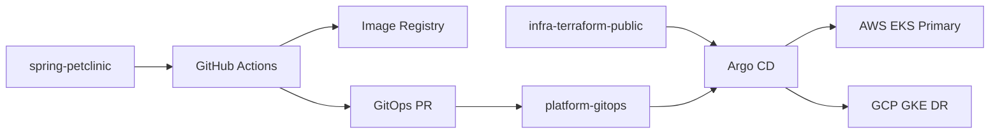

# platform-gitops

[English README](./README.en.md)

AWS EKS를 primary, GCP GKE를 DR 후보로 두고 Spring Petclinic workload를 배포하기 위한 GitOps desired-state repo입니다.  
이 repo는 **Argo CD 설치 repo가 아니라**, Argo CD가 감시하는 배포 상태 repo입니다. Argo CD bootstrap과 platform install은 별도 `infra-terraform-public` repo에서 수행합니다.

## Overview

- `spring-petclinic`: 애플리케이션 image build/publish, 그리고 이 repo로 GitOps PR 생성
- `infra-terraform-public`: infra provisioning, Argo CD/External Secrets/Ingress/Gateway bootstrap
- `platform-gitops`: 실제 배포 대상 manifest와 cloud별 desired state 관리



## 레포 구조

```text
aws/
  00-petclinic-ns.yaml
  11-petclinic-secret-es.yaml
  20-petclinic-Deployments-mysql.yaml
  21-petclinic-hpa.yaml
  30-petclinic-service.yaml
  31-petclinic-ingress.yaml
  32-petclinic-internal-ingress.yaml
  40-karpenter-nodepool.yaml

gcp/
  00-petclinic-ns.yaml
  11-petclinic-secret-es.yaml
  20-petclinic-Deployments-mysql.yaml
  31-petclinic-ingress.yaml
```

- `aws/`: primary 배포용 manifest
- `gcp/`: DR 후보 배포용 manifest
- 공통 리소스는 app namespace, service account, `ExternalSecret`, Deployment, traffic entry입니다.
- AWS 쪽에는 HPA와 Karpenter NodePool 방향이 추가돼 있습니다.

## 운영 모델

- 이 repo는 `dev` / `stage` / `prod`를 나누지 않습니다.
- AWS primary와 GCP DR은 promotion stage가 아니라 **운영 역할**입니다.
- `spring-petclinic` CI는 image를 publish한 뒤 이 repo에 **직접 push하지 않고 PR을 생성**합니다.
- 배포 변경은 Git merge를 통해 반영되고, 이후 Argo CD가 pull-based로 sync합니다.
- rollback은 이 repo에서 `git revert` 후 Argo CD 재동기화로 처리합니다.

## 재현 순서

1. `infra-terraform-public`에서 cluster와 Argo CD, External Secrets, traffic dependency를 bootstrap합니다.
2. 이 repo에서 cloud별 설정값을 Git으로 확정합니다.
3. `spring-petclinic`에서 image를 build/publish합니다.
4. CI가 이 repo에 image tag 변경 PR을 생성합니다.
5. PR review 후 merge하면 Argo CD가 새 desired state를 적용합니다.

초기 확인 포인트:

- image registry URL: `aws/20-petclinic-Deployments-mysql.yaml`, `gcp/20-petclinic-Deployments-mysql.yaml`
- hostname / traffic entry: `aws/31-petclinic-ingress.yaml`, `gcp/31-petclinic-ingress.yaml`
- secret reference: `aws/11-petclinic-secret-es.yaml`, `gcp/11-petclinic-secret-es.yaml`
- GCP project/cluster metadata: `gcp/12-petclinic-clustersecretstore.yaml`
- AWS NodePool placeholder: `aws/40-karpenter-nodepool.yaml`

## Change Control

- secret value는 Git에 저장하지 않고 `ExternalSecret` reference만 커밋합니다.
- PR 검증은 `/.github/workflows/validate-manifests.yml`에서 `yamllint`와 `kubeconform`으로 수행합니다.
- `CODEOWNERS`와 PR template을 두어 scope, risk, rollback을 PR에서 확인하도록 했습니다.
- 운영상 권장 설정은 `main` branch protection + 최소 1명 승인입니다.
- live cluster를 직접 수정하는 방식은 기본 운영 경로로 보지 않습니다.

## 이 repo가 다루는 것 / 밖에 둔 것

이 repo가 다루는 것:

- cloud별 workload desired state
- image tag 변경의 reviewable path
- AWS와 GCP에 대해 분리된 배포 설정과 rollback 경로

이 repo 밖에 둔 것:

- Argo CD 설치와 bootstrap
- Argo CD `Application` / `AppProject` 등록
- Route 53, CloudFront, ACM, WAF 같은 edge routing layer
- Route 53 weight 변경 기반의 DR 전환 도구

즉, 이 repo는 “전체 DR 시스템”이 아니라 **배포 상태를 Git으로 통제하는 레이어**에 집중합니다.

## Scope And Trade-offs

이 repo가 보여주려는 것:

- application source와 deployment state를 분리한 GitOps 운영 방식
- AWS primary / GCP DR 후보 구조에서 cloud별 desired state를 명시적으로 관리하는 방식
- review 가능한 변경 경로와 단순한 rollback 경로

의도적으로 단순화한 것:

- `dev` / `stage` / `prod` 분리는 생략했습니다.
- Argo CD `Application` / `AppProject`는 아직 이 repo가 아니라 infra/bootstrap 레이어 또는 수동 등록에 의존합니다.
- 일부 cluster-scoped resource는 PoC 범위상 이 repo에 남아 있습니다.
- edge DNS / CDN / traffic switching은 이 repo의 재현 범위에 넣지 않았습니다.

## Manual Apply

문제 분석이나 Argo CD 연결 전 검증이 필요할 때는 직접 적용도 가능합니다.

```bash
kubectl apply -f aws/
kubectl apply -f gcp/
```

다만 기본 운영 모델은 manual apply가 아니라 Git merge 후 Argo CD sync입니다.

## Related 레포

- application: `spring-petclinic`
- infra / platform bootstrap: `infra-terraform-public`
